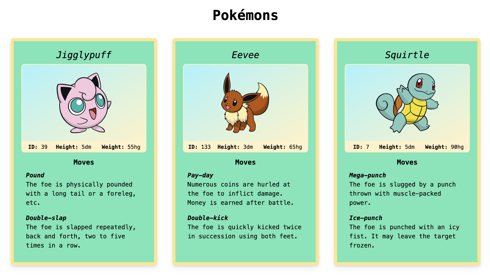

# Løsning på frontend-case

Løsningen er laget i React med TypeScript og Tailwind CSS. Designet er sterkt inspirert av eksemplet som ble gitt, og er ment å være leken og oversiktlig.

## Oppstart

### `npm install`

### `npm run start`

## Kort forklaring

Dataen er hentet fra pokeApi. Hjelpefunksjoner har blitt definert i `util.ts` for å støtte gjenbruk. `types.ts` inneholder også nye interface for å støtte henting av moves. Komponentene er som følger:

### PokemonCard

Representerer hele kortet. Består av undernevnte komponenter.

### Image

Bilde av Pokémonen med gradient-bakgrunn og ramme.

### Stats

Valgte å samle ID, høyde og vekt ettersom

### Moves

Henter kun de to første movesene til pokémonen.
